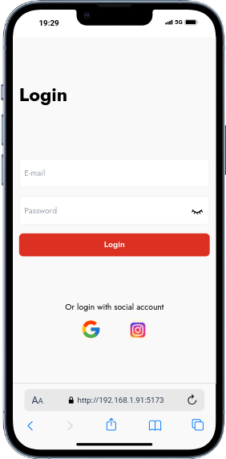
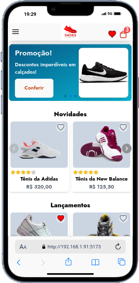

# Shoes Commerce

  <br>
Este é um projeto em desenvolvimento do front end de uma plataforma e-Commerce para empresas do segmento de calçados, o projeto sera desenvolvido com a abordagem mobile first fara simulações de consultas a API utilizando ferramentas como MSW para interceptação de requisições com a intenção1 de deixar o cenário o mais real possível,

## Recursos implementados

- Telas de login, home e favoritos
- Lazy loading
- Componente para menu carrousel 100% reaproveitável utilizando swipper
- Adicionar e remover produtos da lista de favoritos
- Proteção de rotas para favoritos e carrinho de compras
- Formulário de login com validação de credenciais feita no MSW
- Formulário de newsletter com validação de dados
- [Em andamento: cobertura de testes com cypress]

## Tecnologias Utilizadas

<div>


</div>

## Demonstrações

<div>




</div>

### Rodando o projeto

```Javascript
# Faça um clone deste repositório
$ git clone https://github.com/renannevesc94/shoes-commerce.git

# Acesse a pasta do projeto
$ cd shoes-commerce

# Instale as dependências
$ npm install

# Execute a aplicação em modo de desenvolvimento
$ npm run dev
```
